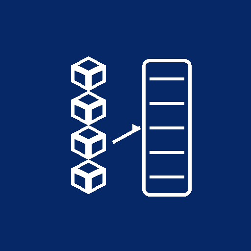

# Entityqueue Form Widget



A handy module to populate a form element in the sidebar of node's add and edit pages to allow editors to add content to entityqueues directly from add/edit forms. This module streamlines content queue management by making queue assignment available during content creation and editing, eliminating the need to navigate to separate queue administration pages.

## Overview

The Entityqueue Form Widget module enhances your content management workflow by integrating entity queue management directly into node creation and editing forms. Instead of creating content and then separately managing which queues it belongs to, editors can now assign queues immediately while working on the content. This saves time and improves editorial efficiency.

### Key Features

* **Integrated Queue Management**: Manage entity queues directly from the node add/edit form sidebar
* **Sidebar Widget**: Convenient field group interface displaying available queues
* **Streamlined Workflow**: No need to navigate away from content editing to manage queue assignments
* **Multi-Queue Support**: Easily assign content to multiple queues simultaneously
* **Form-Based Assignment**: Queue assignment works alongside other node form fields
* **Compatible with Multiple Queue Types**: Works with all entityqueue configurations

## Project Resources

For a full description of the module, visit the
[project page](https://www.drupal.org/project/entityqueue_form_widget).

Submit bug reports and feature suggestions, or track changes in the
[issue queue](https://www.drupal.org/project/issues/entityqueue_form_widget).

## Table of Contents

- [Requirements](#requirements)
- [Installation](#installation)
- [Usage](#usage)
- [Configuration](#configuration)
- [Permissions](#permissions)
- [Queue Management](#queue-management)
- [Maintainers](#maintainers)

## Requirements

* **Drupal 10** or **Drupal 11**
* **Entityqueue module** (required dependency) - [Entityqueue on Drupal.org](https://www.drupal.org/project/entityqueue)

## Installation

Install as you would normally install a contributed Drupal module. For further information, see [Installing Drupal Modules](https://www.drupal.org/docs/extending-drupal/installing-drupal-modules).

### Quick Install via Drush

```bash
composer require 'drupal/entityqueue_form_widget:^2.0'
drush en entityqueue_form_widget
drush cr
```

### Manual Installation

1. Download or require the module via Composer
2. Place the module in your `modules/contrib` directory
3. Navigate to **Administration > Extend** (admin/modules)
4. Search for "Entityqueue Form Widget"
5. Enable the module
6. Clear the site cache

### Installation via Composer (Recommended)

```bash
composer require 'drupal/entityqueue_form_widget:^2.0'
```

This will download the module and add it to your project's dependencies.

## Usage

### Viewing the Entityqueue Widget

Once the module is enabled, the Entityqueue Form Widget automatically appears on node add and edit forms:

1. Navigate to **Create a new node** or **Edit an existing node** (any content type)
2. Look for the **Entityqueues** field group in the right sidebar
3. The widget displays all available entity queues configured for your site

### Assigning Content to Queues

To add content to one or more entity queues:

1. Create a new node or edit an existing one
2. In the right sidebar, locate the **Entityqueues** field group
3. Check the boxes next to the queues where you want to add this content
4. Complete the rest of the node form as usual
5. Save the node

The content will be immediately assigned to the selected queues when you save the form.

### Removing Content from Queues

To remove content from entity queues:

1. Edit the node
2. In the **Entityqueues** field group, uncheck the queues you want to remove the content from
3. Save the node

The content will be removed from the unchecked queues upon save.

### Managing Queue Order

While the form widget allows you to assign content to queues, detailed queue management and reordering requires visiting the dedicated queue administration page:

1. Navigate to **Administration > Structure > Entity Queues** (admin/structure/entityqueue)
2. Click on the queue you want to manage
3. Drag to reorder items, or use the queue's management interface
4. Save changes

## Configuration

### Enabling Entity Queues for Content Types

To make entity queues available in the node form widget, you need to configure which queues should appear:

1. Create or configure entity queues through **Administration > Structure > Entity Queues** (admin/structure/entityqueue)
2. Queues can be configured to target specific entity types and bundles
3. Once configured, queues will automatically appear in the form widget for nodes of the matching type

### Entity Queue Creation

To create a new entity queue:

1. Navigate to **Administration > Structure > Entity Queues** (admin/structure/entityqueue)
2. Click **Add Entity Queue**
3. Enter the queue name and label
4. Configure the target entity type (e.g., Node) and bundle (e.g., Article, Page)
5. Set queue properties (size limit, handler, etc.)
6. Save the queue

Once created, the queue will immediately appear in the Entityqueue Form Widget on matching node forms.

## Permissions

The Entityqueue Form Widget module respects the permissions defined by the Entityqueue module:

### Required Permissions for Queue Management

To enable users to assign content to queues through the form widget, they need the following permissions:

* **Create [Entity Queue] subqueues** - Allows creating new subqueue entries
* **Edit [Entity Queue] subqueues** - Allows modifying existing queue assignments
* **Delete [Entity Queue] subqueues** - Allows removing content from queues

### Recommended Permission Assignments

**Admin Role:**
- ✓ All Entityqueue permissions
- ✓ Create/Edit/Delete subqueues for all queues

**Editor / Content Manager Role:**
- ✓ Create/Edit/Delete subqueues (for queues they should manage)
- ✗ View only access to queue administration

**Content Creator Role:**
- ✓ Create/Edit subqueues (limited to specific queues)
- ✗ Delete subqueues

**Viewer Role:**
- ✗ No queue management permissions
- ✗ No access to Entityqueue Form Widget

### Setting Permissions

1. Navigate to **Administration > People > Permissions** (admin/people/permissions)
2. Search for "entityqueue" or the specific queue name
3. Assign permissions to roles as needed
4. Click **Save permissions**

## Queue Management

### What Gets Stored

When you assign content to queues through the form widget, the module stores:

* **Entity Queue Subqueue** - A record linking the node to the queue
* **Weight/Position** - The order of items in the queue (managed separately)
* **Timestamp** - When the item was added to the queue

### Queue Features

* **Multiple Queues per Content**: A single node can be in multiple queues simultaneously
* **Queue Priority**: Queues can have size limits and ordering rules
* **Flexible Assignment**: Assign or remove content with simple checkbox interactions
* **Form Integration**: All queue management happens during normal content editing

### Viewing Queue Contents

To see all content in a queue:

1. Navigate to **Administration > Structure > Entity Queues** (admin/structure/entityqueue)
2. Click the queue name you want to view
3. See all items currently in that queue
4. Manage order and contents

## Troubleshooting

### Entityqueues Widget Not Appearing

If the widget doesn't appear on node forms:

1. **Verify Entityqueue module is installed**: Navigate to Admin > Modules and ensure the Entityqueue module is enabled
2. **Check if queues exist**: Ensure you have at least one entity queue configured at Admin > Structure > Entity Queues
3. **Verify queue targets**: Ensure the queue is configured to target the content type you're editing
4. **Clear cache**: Run `drush cr` or clear cache from Admin > Configuration > Development > Performance
5. **Check permissions**: Ensure your user account has permissions to manage subqueues

### Cannot Assign Content to Queues

If you can't select or save queue assignments:

1. **Check permissions**: Verify you have "Edit [Queue Name] subqueues" permission
2. **Verify queue target**: Ensure the queue targets the correct entity type and content type
3. **Check for errors**: Look for error messages in the form submission
4. **Review queue settings**: Some queues may have restrictions on content types or entity types

### Performance Issues with Many Queues

If the form widget is slow with many queues:

1. **Limit queues per form**: Consider configuring which queues target each content type
2. **Review queue configuration**: Ensure queues are properly configured and not overly complex
3. **Check permissions**: Remove unnecessary queue permissions to reduce widget rendering
4. **Clear cache**: Run a full cache clear and ensure cache is working properly

## Version Information

* **Current Version**: 2.0.7 (stable, released June 2024)
* **Drupal Compatibility**: Drupal 10 and 11
* **Status**: Covered by Drupal Security Advisory Policy
* **Maintainer**: [Vardot](https://vardot.com)

## Maintainers

- Vardot Team - [Vardot](https://vardot.com)
